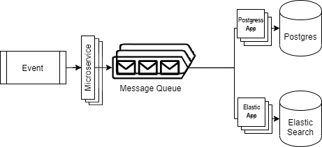

# MicroService Sample ZooKeeper, Kafka, Docker, Kubernetes
 
## Merhaba

Bu proje basit bir şekilde, bir REST servise gelen event/log olaylarını Kafka aracılığı ile mesaj lar haline getirip kuyruğa ekler. Kuyruğa bağlanmış olan uygulamalar ise bu mesajları dinliyor ve temsili olarak Elastic Search ve Postgres basıyor olacak.
Proje içinde Çoklu ZooKeeper ve Çoklu Kafka ayağa kaldırılacak. (Direk docker üzerinde)
Projedeki WEB uygulaması, Elastic Search ve Postgres uygulaması KUBERNETES cluster'i olarak 3 replica şeklinde ayağa kaldırılacak.

### Senaryo

Birçok mikroservisin olduğu bir sistemde, diğer servislerde oluşan olay/eventleri toparlayacak yeni bir mikroservis oluşturacağız.

Yeni servisimiz üzerindeki tek REST API endpoint aracılığı ile diğer servislerden olayı detaylarıyla birlikte alacak ve Kafka'ya iletecek.

Kafka ise aldığı mesajları minimum 2 farklı sisteme dağıtacak. Bu iki sistemde de bu mesajları 2 farklı sistem karşılıcak.

#### Test Mesajı Yollayıcı  : TestSender         -> Producer(Üretici)
#### WEB Uygulamamız 	    : MicroServiceSample -> Producer(Üretici) -> Kubernete Üzerinde Koşacak (3 Replica)
#### Temsili Elastic Search : ElasticSearchApp   -> Consumer(Alıcı)   -> Kubernete Üzerinde Koşacak (3 Replica)
#### Temsili Postgres App   : PostgresApp        -> Consumer(Alıcı)   -> Kubernete Üzerinde Koşacak (3 Replica)

### Teknik Tasarım

#### Not : Proje ye başalamadan önce Docker-Desktop içerinden ayarlar bölümünden kubernetes'i aktif hale getirin.


- Aşağıdaki linkten Chocolatey paket yöneticisini yükleyin.
- https://chocolatey.org/install
- Aşağıdaki linkten Chocolatey paket yöneticisini yükleyiniz. (Admin modunda powershell açıp çalıştırın)
- `choco install -y skaffold`   


<div align="center">
  
</div>

- Kaynak sistemde oluşan olay/eventler, oluşturulacak yeni bir servise HTTP kanalı üzerinden bir dizi/array biçiminde iletilecektir.

- Servise iletilen her bir olay/event mesaj kuyruğuna bir mesaj nesnesi olarak eklenecektir.

- İlk abone olayı detayları ile ElasticSearch üzerine yazacak,

- İkinci abone olayı Postgres’de oluşturulmuş tablo üzerine kaydedecek,


### Teknik Bilgiler

- Kullanılan Teknolojiler
  - .NET Core
  - Kafka
  - Docker
  - Kubernetes
  - Skaffold
  - chocolatey
  - Git
  - Mesajları diğer servislerden toplayan ve kanallarda karşılayan tüm uygulamaların docker-compose dosyasına işlenmesi
  - docker-compose dosyası skaffold ile kubernetes yaml dosyasına çevirilmiştir.
    (Çevrilen dosyalar üzerinde ayrıca editleme işlemleri gerekmektedir. Fakat dosyaları kaybetmeniz halinde aşağıdaki komut ile tekrar oluşturabilirsiniz.)
  - `skaffold.exe init --compose-file docker-compose.yml`
  - `KafkaStarter/start_docker.bat` dosyası ile kafka ve zookeeper servislerinin ayağa kaldırılabilirliği  
  - `skaffold run` komutu ile tüm sistemin ayağa kaldırılabilirliği
  - Projenin nasıl çalıştırılacağına dair README.md dokümantasyonu


### API URL Örneği : https://host.docker.internal:30000/WebApi/WebApi

#### POST / - Event İletme

#### Postman ile POST tipinde BODY'yi seçerek RAW formatında JSON tipini seçerek aşağıdaki veriyi göndererek test edebilirsiniz.

Request:

```http
POST /
Content-Type: application/json

{
  "events": [
    {
      "app": "277cdc8c-b0ea-460b-a7d2-592126f5bbb0",
      "type": "HOTEL_CREATE",
      "time": "2020-02-10T13:40:27.650Z",
      "isSucceeded": true,
      "meta": {},
      "user": {
        "isAuthenticated": true,
        "provider": "b2c-internal",
        "email": "test1@hotmail.com",
		"id": 1
      },
      "attributes": {
        "hotelId": 1,
        "hotelRegion": "Kıbrıs",
        "hotelName": "Rixos"
      }
    },
    {
      "app": "277cdc8c-b0ea-460b-a7d2-592126f5bbb1",
      "type": "HOTEL_CREATE",
      "time": "2020-02-10T13:40:27.650Z",
      "isSucceeded": true,
      "meta": {},
      "user": {
        "isAuthenticated": true,
        "provider": "b2c-internal",
        "id": 2,
        "email": "test2@hotmail.com"
      },
      "attributes": {
        "hotelId": 1,
        "hotelRegion": "Kıbrıs",
        "hotelName": "Rixos"
      }
    },
    {
      "app": "277cdc8c-b0ea-460b-a7d2-592126f5bbb2",
      "type": "HOTEL_CREATE",
      "time": "2020-02-10T13:40:27.650Z",
      "isSucceeded": true,
      "meta": {},
      "user": {
        "isAuthenticated": true,
        "provider": "b2c-internal",
        "id": 3,
        "email": "test2@hotmail.com"
      },
      "attributes": {
        "hotelId": 1,
        "hotelRegion": "Kıbrıs",
        "hotelName": "Rixos"
      }
    }
  ]
}


```

Response:

```http
HTTP 200 OK
```

Alanlar:

|Alan                 |Açıklama                                                 |Tip      |Zorunluluk |
|---------------------|---------------------------------------------------------|---------|-----------|
|app                  |Guid cinsinden uygulamanın kimliği                       |Guid     |Evet       |
|type                 |Event/olay kategorisi                                    |Enum     |Evet       |
|time                 |Olayın gerçekleştiği zaman                               |DateTime |Evet       |
|isSucceeded          |İlgili olay başarıyla sonlanmış mı?                      |Boolean  |Evet       |
|meta.*               |Olaya ait ek detaylar                                    |Object   |Hayır      |
|user.isAuthenticated |Olayı gerçekleştiren kullanıcı giriş yapmış mı?          |Boolean  |Evet       |
|user.provider        |Olayı gerçekleştiren kullanıcının kaydı hangi sistemde?  |String   |Evet       |
|user.id              |Olayı gerçekleştiren kullanıcının id’si                  |Long     |Evet       |
|user.email           |Olayı gerçekleştiren kullanıcının e-mail bilgisi         |String   |Hayır      |
|attributes.*         |Olaya kategorisine özel detaylar                         |Object   |Hayır      |


### Nasıl başlayabilirim?

- Öncelikle docker programını yüklemelisiniz. Docker CAAS teknolojilerini araştırarak bilgi sahibi olabilirsiniz.
- Kubernetes ve Skaffold hakkında araştırma yapıp bilgi sahibi olmalısınız.

- docker programını yükledikten sonra Docker-Desktop'ın ayarlar bölümüne gidip kubernetes özelliğini aktif etmiş olmalısınız.

- Chocolatey paket yöneticisini yüklemiş olmalısınız.

- Skaffold programını yüklemiş olmalısınız.

- sonra aşağıdaki kodu projenin klasörünün içindeki açıp çalıştırıyoruz. Bu işlem ZooKeeper ve Kafka Servislerini 3 Örnek ayağa kaldıracak.
  Servisler ayağa kalktıktan sonra topics adında  kanal oluşturup hazırlayacak.
 
- `KafkaStarter/start_docker.bat`

- Yukarıdaki kod başarı ile çalıştıktan sonra bizim yazdığımız Producer (Üretici) ve Consumer (Alıcı) projelerimizi 3 replica olarak kubernetes içinde çalıştıracak olan aşağıdaki komutu çalıştırıyoruz.
 
- `skaffold run`

- Ardından Test Gönderici Projemiz olan TestSender projemizi başlatabiliriz. Bu projemizi çalıştırıp enter'a bastığınızda mesajınız Kafka üzerinden diğer alıcılara dağıtılacaktır.

- Yukarıdaki test sonucunda başarılı olduğunda son adım olan WEB projemiz'e geçebilirsiniz.

- Projelerimiz ayağa kalktıktan sonra aşağıdaki URL den sistemimizin ayağa kalkıp kalkmadığını kontrol edebilirsiniz.

- `http://host.docker.internal:30000/`  


- Yukarıdaki bahsi geçen postman ile ilgili JSON'ı  https://host.docker.internal:30000/WebApi/WebApi adresini çağırdığınızda ilgili verileri Kafka üzerinden ilgili uygulamalara iletmiş olduğunu göreceksiniz. :)


## Sorularınız

Değerlendirmelerle ilgili sorularınızı [hakhay8388@hotmail.com](mailto:hakhay8388@hotmail.com) adresine iletebilirsiniz.


